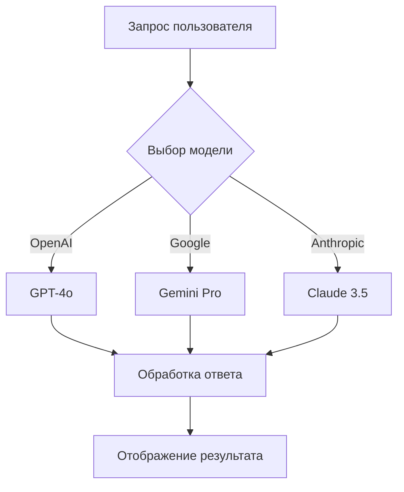

# План: Интеграция Mermaid-диаграмм и интерактивного редактора flow-диаграмм

## Обзор

Реализуем две связанные функции:

1. **Mermaid в чатах** — AI сможет генерировать блок-схемы, sequence-диаграммы, mindmaps и другие визуализации прямо в ответах. Будет работать в основном чате и D-chat.

2. **Редактор Data-Flow диаграмм** — интерактивный визуальный инструмент для проектирования логики AI-промптов, цепочек обработки и data-flow. С drag-and-drop, экспортом и возможностью сохранения.

## Архитектура решения

```text
┌─────────────────────────────────────────────────────────────────┐
│                    MarkdownRenderer                              │
│  ┌──────────────┐  ┌──────────────┐  ┌──────────────┐          │
│  │ CodeBlock    │  │ MermaidBlock │  │ KaTeX        │          │
│  │ (syntax)     │  │ (диаграммы)  │  │ (формулы)    │          │
│  └──────────────┘  └──────────────┘  └──────────────┘          │
└─────────────────────────────────────────────────────────────────┘

┌─────────────────────────────────────────────────────────────────┐
│              FlowDiagramEditor (новая страница)                 │
│  ┌───────────────────────────────────────────────────────────┐ │
│  │ ReactFlow Canvas                                          │ │
│  │  ┌─────┐    ┌─────┐    ┌─────┐                           │ │
│  │  │Node │───▶│Node │───▶│Node │                           │ │
│  │  └─────┘    └─────┘    └─────┘                           │ │
│  └───────────────────────────────────────────────────────────┘ │
│  ┌──────────┐  ┌──────────┐  ┌──────────┐  ┌──────────┐       │
│  │ Toolbar  │  │ Sidebar  │  │ Export   │  │ Save     │       │
│  └──────────┘  └──────────┘  └──────────┘  └──────────┘       │
└─────────────────────────────────────────────────────────────────┘
```

---

## Часть 1: Mermaid-диаграммы в чатах

### Новые зависимости

| Пакет | Назначение |
|-------|------------|
| `mermaid` | Парсинг и рендеринг Mermaid-диаграмм |

### Новые файлы

| Файл | Описание |
|------|----------|
| `src/components/warroom/MermaidBlock.tsx` | Компонент рендеринга Mermaid-диаграмм |

### Изменения в существующих файлах

| Файл | Изменения |
|------|-----------|
| `src/components/warroom/MarkdownRenderer.tsx` | Интеграция MermaidBlock в CodeBlock |

### Логика работы

1. В `MarkdownRenderer` при обнаружении code-блока с `language-mermaid` вместо SyntaxHighlighter рендерится `MermaidBlock`
2. `MermaidBlock` использует `mermaid.render()` для генерации SVG
3. Добавляется кнопка копирования исходного кода диаграммы
4. Поддержка светлой/темной темы через конфигурацию mermaid

### Поддерживаемые типы диаграмм

- **Flowchart** — блок-схемы (`graph TD`, `graph LR`)
- **Sequence** — диаграммы последовательности
- **Class** — диаграммы классов (для data models)
- **State** — диаграммы состояний
- **ER** — entity-relationship (для DB схем)
- **Mindmap** — ментальные карты
- **Gantt** — для планирования

### Пример использования в чате

AI может генерировать:

````text

````

---

## Часть 2: Интерактивный редактор Flow-диаграмм

### Новые зависимости

| Пакет | Назначение |
|-------|------------|
| `@xyflow/react` | Интерактивный редактор node-based диаграмм |

### Новые файлы

| Файл | Описание |
|------|----------|
| `src/pages/FlowEditor.tsx` | Страница редактора |
| `src/components/flow/FlowCanvas.tsx` | Основной canvas с ReactFlow |
| `src/components/flow/FlowSidebar.tsx` | Панель элементов для drag-and-drop |
| `src/components/flow/FlowToolbar.tsx` | Панель инструментов |
| `src/components/flow/nodes/InputNode.tsx` | Узел входных данных |
| `src/components/flow/nodes/ProcessNode.tsx` | Узел обработки (AI модель) |
| `src/components/flow/nodes/OutputNode.tsx` | Узел вывода |
| `src/components/flow/nodes/ConditionNode.tsx` | Узел условия/ветвления |
| `src/components/flow/nodes/PromptNode.tsx` | Узел системного промпта |
| `src/components/flow/nodes/ToolNode.tsx` | Узел инструмента |
| `src/hooks/useFlowDiagrams.ts` | Хук для работы с сохранёнными диаграммами |

### Изменения в существующих файлах

| Файл | Изменения |
|------|-----------|
| `src/components/layout/AppSidebar.tsx` | Добавление пункта меню "Редактор flow" |
| `src/App.tsx` | Добавление маршрута `/flow-editor` |
| `src/contexts/LanguageContext.tsx` | Локализация для редактора |

### Типы узлов редактора

| Тип узла | Назначение | Цвет |
|----------|------------|------|
| `input` | Входные данные (запрос пользователя) | Синий |
| `prompt` | Системный промпт из библиотеки | Фиолетовый |
| `model` | AI модель для обработки | Зелёный |
| `condition` | Условие/ветвление | Жёлтый |
| `tool` | Вызов инструмента | Оранжевый |
| `output` | Выходные данные | Бирюзовый |

### Функционал редактора

- **Drag-and-drop** узлов из боковой панели
- **Соединения** между узлами с валидацией типов
- **Редактирование** параметров узла в панели справа
- **Mini-map** для навигации
- **Zoom и Pan** управление
- **Экспорт** в PNG/SVG/JSON
- **Сохранение** диаграмм в базу данных
- **Генерация Mermaid** кода из диаграммы

### Сохранение диаграмм

Диаграммы сохраняются в новую таблицу `flow_diagrams`:

```sql
CREATE TABLE flow_diagrams (
  id UUID PRIMARY KEY DEFAULT gen_random_uuid(),
  user_id UUID REFERENCES auth.users(id) ON DELETE CASCADE NOT NULL,
  name TEXT NOT NULL,
  description TEXT,
  nodes JSONB NOT NULL DEFAULT '[]',
  edges JSONB NOT NULL DEFAULT '[]',
  viewport JSONB DEFAULT '{"x": 0, "y": 0, "zoom": 1}',
  is_shared BOOLEAN DEFAULT false,
  created_at TIMESTAMPTZ DEFAULT now(),
  updated_at TIMESTAMPTZ DEFAULT now()
);

-- RLS политики
ALTER TABLE flow_diagrams ENABLE ROW LEVEL SECURITY;

CREATE POLICY "Users can view own and shared diagrams"
ON flow_diagrams FOR SELECT
USING (user_id = auth.uid() OR is_shared = true);

CREATE POLICY "Users can manage own diagrams"
ON flow_diagrams FOR ALL
USING (user_id = auth.uid());
```

---

## Навигация

Новый пункт в боковом меню:

| Путь | Иконка | Название |
|------|--------|----------|
| `/flow-editor` | `GitBranch` | Редактор flow |

---

## Локализация

Новые ключи переводов:

```typescript
// Mermaid
'mermaid.error': { ru: 'Ошибка рендеринга диаграммы', en: 'Diagram render error' },
'mermaid.copy': { ru: 'Копировать код', en: 'Copy code' },

// Flow Editor
'flowEditor.title': { ru: 'Редактор Data-Flow', en: 'Data-Flow Editor' },
'flowEditor.description': { ru: 'Визуальное проектирование логики AI-промптов и цепочек обработки', en: 'Visual design for AI prompt logic and processing chains' },
'flowEditor.newDiagram': { ru: 'Новая диаграмма', en: 'New Diagram' },
'flowEditor.save': { ru: 'Сохранить', en: 'Save' },
'flowEditor.export': { ru: 'Экспорт', en: 'Export' },
'flowEditor.exportPng': { ru: 'Экспорт в PNG', en: 'Export as PNG' },
'flowEditor.exportSvg': { ru: 'Экспорт в SVG', en: 'Export as SVG' },
'flowEditor.exportJson': { ru: 'Экспорт в JSON', en: 'Export as JSON' },
'flowEditor.generateMermaid': { ru: 'Сгенерировать Mermaid', en: 'Generate Mermaid' },
'flowEditor.nodes.input': { ru: 'Вход', en: 'Input' },
'flowEditor.nodes.prompt': { ru: 'Промпт', en: 'Prompt' },
'flowEditor.nodes.model': { ru: 'AI Модель', en: 'AI Model' },
'flowEditor.nodes.condition': { ru: 'Условие', en: 'Condition' },
'flowEditor.nodes.tool': { ru: 'Инструмент', en: 'Tool' },
'flowEditor.nodes.output': { ru: 'Выход', en: 'Output' },
'flowEditor.sidebar.elements': { ru: 'Элементы', en: 'Elements' },
'flowEditor.sidebar.dragHint': { ru: 'Перетащите на холст', en: 'Drag to canvas' },
'flowEditor.empty': { ru: 'Перетащите элементы на холст для создания диаграммы', en: 'Drag elements to canvas to create a diagram' },
'flowEditor.saved': { ru: 'Диаграмма сохранена', en: 'Diagram saved' },
'flowEditor.deleted': { ru: 'Диаграмма удалена', en: 'Diagram deleted' },
```

---

## Порядок реализации

### Этап 1: Mermaid в чатах
1. Установить `mermaid`
2. Создать `MermaidBlock.tsx`
3. Интегрировать в `MarkdownRenderer.tsx`
4. Добавить локализацию

### Этап 2: Редактор Flow-диаграмм
1. Установить `@xyflow/react`
2. Создать миграцию для таблицы `flow_diagrams`
3. Создать кастомные узлы
4. Создать компоненты редактора
5. Создать страницу и маршрут
6. Добавить в навигацию
7. Реализовать сохранение/загрузку
8. Добавить экспорт

---

## Технические детали

### MermaidBlock

```tsx
// Логика рендеринга
useEffect(() => {
  mermaid.initialize({
    startOnLoad: false,
    theme: theme === 'dark' ? 'dark' : 'default',
    securityLevel: 'strict',
  });
  
  mermaid.render(id, content)
    .then(({ svg }) => setSvg(svg))
    .catch(setError);
}, [content, theme]);
```

### ReactFlow интеграция

```tsx
// Кастомный узел модели
const ModelNode = ({ data }) => (
  <div className="px-4 py-2 bg-hydra-success/20 border border-hydra-success rounded-lg">
    <Handle type="target" position={Position.Top} />
    <div className="flex items-center gap-2">
      <Brain className="h-4 w-4" />
      <span>{data.modelName}</span>
    </div>
    <Handle type="source" position={Position.Bottom} />
  </div>
);
```

### Экспорт в Mermaid

Редактор сможет генерировать Mermaid-код из визуальной диаграммы:

```typescript
function exportToMermaid(nodes: Node[], edges: Edge[]): string {
  let mermaid = 'graph TD\n';
  
  nodes.forEach(node => {
    const shape = node.type === 'condition' ? '{' : '[';
    mermaid += `    ${node.id}${shape}${node.data.label}${shape === '{' ? '}' : ']'}\n`;
  });
  
  edges.forEach(edge => {
    const label = edge.label ? `|${edge.label}|` : '';
    mermaid += `    ${edge.source} -->${label} ${edge.target}\n`;
  });
  
  return mermaid;
}
```
