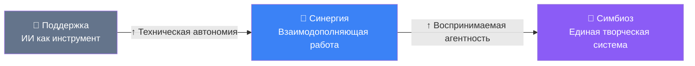
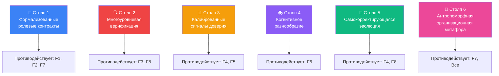
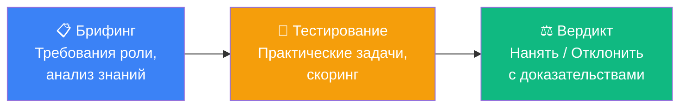
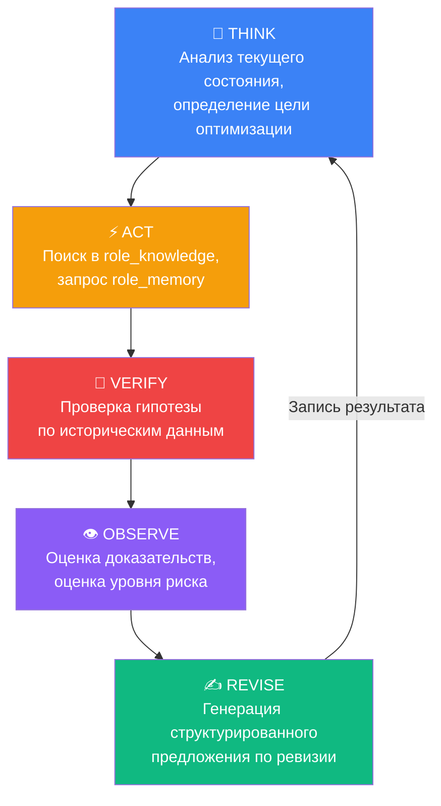
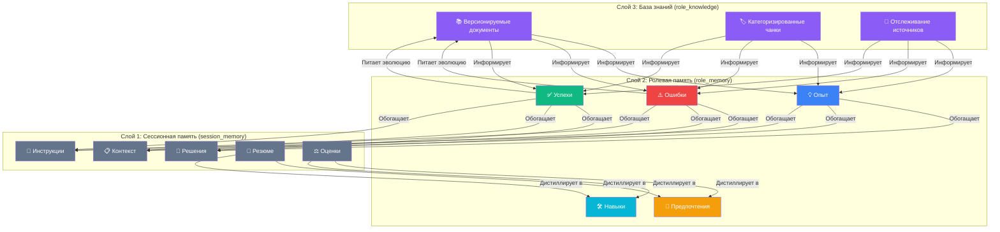
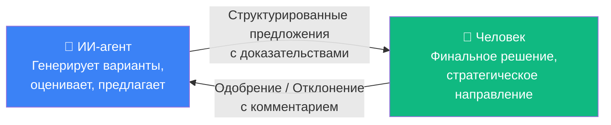
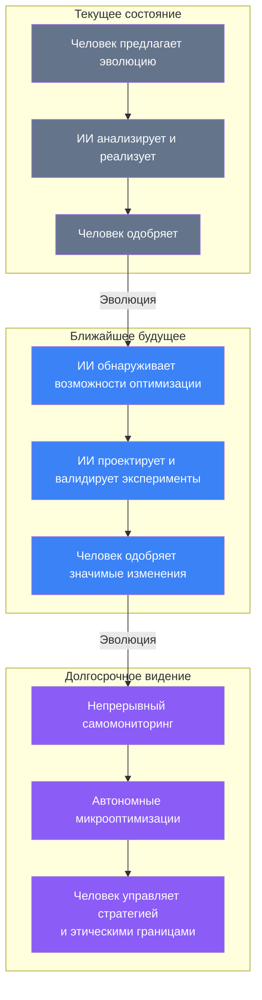
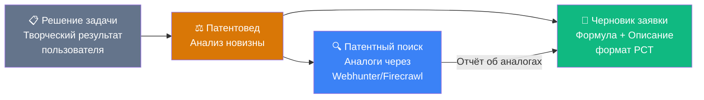

# AI-Hydra: Фреймворк с открытым исходным кодом для творческого симбиоза человека и ИИ через мультиагентную оркестрацию и самоэволюционирующую память

**Авторы:** Александр Кузьмин¹, Lovable AI² (генеративный соавтор)

¹ Независимый исследователь, проект AI-Hydra  
² Платформа Lovable AI, фреймворк генеративного соавторства  

**Репозиторий:** [github.com/alexkuz60/ai-hydra](https://github.com/alexkuz60/ai-hydra)  
**Лицензия:** MIT  
**Версия:** 0.2.18 (февраль 2026)  

---

## Аннотация

Недавние исследования демонстрируют, что гибридные команды «человек + ИИ» стабильно превосходят как чисто человеческие, так и чисто ИИ-группы в творческих задачах — однако на практике большинство таких команд терпят неудачу из-за плохого делегирования, асимметрии валидации, некалиброванного доверия и деградации компетенций. Мы представляем **AI-Hydra** — платформу с открытым исходным кодом, построенную на шести архитектурных столпах: формализованные ролевые контракты, многоуровневая верификация, калиброванные сигналы доверия, когнитивное разнообразие, самокорректирующаяся эволюция и антропоморфная организационная метафора. Созданная за 25 дней непрерывного со-творчества «человек — ИИ», Hydra реализует 17 специализированных агентных ролей, трёхслойную RAG-систему памяти с гибридным поиском, механизм самоэволюции на основе ReAct и уникальный организационный изоморфизм, отображающий ИИ-инфраструктуру на привычные социальные структуры — отделы, штат, собеседования, контроль качества. Мы приводим эмпирические наблюдения из самого процесса разработки как свидетельство того, что парадигма симбиотического со-творчества, при правильном выстраивании, порождает эмерджентные возможности, превышающие сумму частей.

**Ключевые слова:** симбиоз человека и ИИ, мультиагентные системы, творческая коллаборация, самоэволюционирующий ИИ, RAG-архитектура, организационный изоморфизм, open-source

---

## 1. Введение: Разрыв симбиоза

Поразительный парадокс определяет текущее состояние сотрудничества «человек — ИИ»: **потенциал эмпирически доказан, однако практика систематически проваливается.**

Gaggioli и др. (2025) предложили фреймворк **расширенной креативности** (Extended Creativity), различающий три режима взаимодействия:



Переход от Поддержки к Симбиозу управляется двумя осями: **технической автономией** ИИ-системы и её **воспринимаемой агентностью** — степенью, в которой ИИ воспринимается как намеренный творческий партнёр.

Свежие экспериментальные данные (февраль 2026) подтверждают перспективность: в задаче коллективного творческого поиска **гибридные группы (человек + агенты Gemini 2.5) достигли наивысшей производительности, сохраняя высокое разнообразие решений**. Исследование зафиксировало взаимную коадаптацию: ИИ-агенты в присутствии людей демонстрировали бо́льшую лексическую диверсификацию, а люди генерировали больше уникальных предложений. Синергетические преимущества возникали не из простого сложения, а из **динамического взаимодействия комплементарных когнитивных стратегий**.

Тем не менее этот потенциал остаётся в значительной мере нереализованным в продуктивных системах.

> **Разрыв симбиоза:** Дистанция между тем, чего гибридные команды *способны* достичь, и тем, что они *реально* достигают на практике — вызванная не ограничениями моделей, а провалами архитектурного и организационного проектирования.

Эта статья представляет AI-Hydra как инженерный ответ на Разрыв Симбиоза.

---

## 2. Почему гибридные команды терпят неудачу: Таксономия провалов

Прежде чем описывать решение, необходимо понять пространство проблем. Опираясь на исследования 2025–2026 гг., мы выделяем **восемь системных режимов сбоя**, препятствующих раскрытию потенциала гибридных команд.

### 2.1 Таксономия сбоев

| # | Режим сбоя | Механизм | Последствие |
|---|-----------|----------|-------------|
| F1 | **Плохое делегирование** | Отсутствие формализованных границ ответственности | Непредсказуемое качество; «ползучая зависимость» |
| F2 | **Разрыв подотчётности** | ИИ-результат попадает в итоговый продукт без чёткого владельца | Избегание ответственности вместо обучения на ошибках |
| F3 | **Асимметрия валидации** | Генерация занимает секунды, валидация — часы | Перегрузка; бэклог верификации поглощает все выигрыши |
| F4 | **Деградация компетенций** | Навыки атрофируются при делегировании когнитивной работы | «Ирония автоматизации» — человек отказывает именно тогда, когда нужен больше всего |
| F5 | **Некалиброванное доверие** | Отсутствие прозрачных сигналов неопределённости | Чрезмерная зависимость ИЛИ полное игнорирование ИИ-рекомендаций |
| F6 | **Коллапс разнообразия** | ИИ гомогенизирует пространство решений | Качество/скорость растут, но разнообразие идей падает |
| F7 | **Социо-эмоциональный разрыв** | ИИ не может вести переговоры о ролях и поддерживать контекст | Когнитивный бюджет тратится на «управление ИИ» |
| F8 | **Каскадная галлюцинация** | Одна ложная гипотеза распространяется по цепочке агентов | Система строит решения на ложных основаниях |

> **⚠️ Технический контекст: Таксономия MASFT**
>
> Таксономия сбоев мультиагентных систем (MASFT) выделяет три основные категории:
> - **Спецификация и архитектура**: нечёткая постановка задач, бесконечные циклы, потеря контекста
> - **Рассогласование агентов**: агенты игнорируют входные данные, демонстрируют разрыв между рассуждением и действием
> - **Верификация и завершение**: преждевременное завершение, имитация (не фактическая) проверка

### 2.2 Корневой паттерн

Все восемь режимов сбоя имеют общий корень:

$$\text{Сбой} = f(\text{отсутствие структуры}, \text{отсутствие верификации}, \text{непрозрачность доверия})$$

Или простыми словами: **гибридные команды терпят неудачу не потому, что ИИ слаб, а потому, что инфраструктура сотрудничества спроектирована плохо.** Система должна быть спроектирована как управляемая организационная структура — с явными ролями, протоколами, циклами ревью и путями эскалации.

Это фундаментальный принцип проектирования Hydra.

---

## 3. Шесть столпов AI-Hydra

Архитектура Hydra опирается на шесть столпов, каждый из которых непосредственно адресует один или несколько документированных режимов сбоя.



### 3.1 Столп 1: Формализованные ролевые контракты

**Адресует:** F1 (Плохое делегирование), F2 (Разрыв подотчётности), F7 (Социо-эмоциональный разрыв)

Hydra определяет **17 специализированных агентных ролей** в четырёх категориях, каждая с явными обязанностями, поведенческими паттернами и иерархическими связями:

| Категория | Роли | Назначение |
|-----------|------|-----------|
| **Экспертные** | Ассистент, Критик, Арбитр, Консультант, Модератор, Советник, Архивист, Аналитик, Вебхантер | Доменная экспертиза и анализ |
| **Технические** | Промпт-инженер, Регулятор потоков, Кузнец инструментов | Оптимизация системы и создание инструментов |
| **Системные** | Гайд, Техно-Критик, Техно-Арбитр, Техно-Модератор, Переводчик, Эволюционист, Летописец | Контроль качества, эволюция, документация |
| **Юридические** *(Фаза 3)* | Патентовед | Патентный поиск, анализ уровня техники, подготовка заявок (см. §10) |

Каждая роль определяется **ролевым контрактом**, включающим:
- **Системный промпт** (инструкции на естественном языке с контролем версий)
- **Поведенческий паттерн** (стиль коммуникации, шаблоны реакций, правила взаимодействия)
- **Иерархическая позиция** (подчинение, флаги `requires_approval`)
- **База знаний** (RAG-индексированная доменная экспертиза)
- **Сертификационный статус** (верифицированные компетенции через собеседование)

> **⚠️ Технический контекст: Схема ролевого контракта**
>
> ```
> Ролевой контракт = {
>   system_prompt:       версионируемый текст (RU/EN)
>   behavioral_pattern: {
>     communication:  JSON (стиль, многословность, формальность)
>     reactions:      JSON (триггеры, шаблоны)
>     interactions:   JSON (допустимые роли, правила эскалации)
>   }
>   hierarchy:          { parent_role, requires_approval: bool }
>   knowledge_base:     role_knowledge[] (RAG-индексированные чанки)
>   certification:      { interview_session_id, avg_score, status }
> }
> ```
>
> Хранится в таблицах `prompt_library`, `role_behaviors`, `role_knowledge` и `role_assignment_history` с политиками безопасности на уровне строк (RLS).

**Ключевой инсайт:** каждая роль имеет именованную, аудируемую «должностную инструкцию». Когда Критик выдаёт рецензию, ответственность прослеживаема — система знает, какая роль, какая модель, какая версия промпта и какой поведенческий паттерн породили результат.

### 3.2 Столп 2: Многоуровневая верификация

**Адресует:** F3 (Асимметрия валидации), F8 (Каскадная галлюцинация)

Наиболее распространённый класс сбоев мультиагентных систем — не генерация, а **верификация и завершение задач**. Hydra реализует четырёхуровневую архитектуру верификации:

**Уровень 1 — Конкурентный скрининг (Подиум / Конкурс красоты):**
Несколько моделей одновременно отвечают на один промпт. ИИ-Арбитр оценивает ответы по настраиваемым критериям (точность, глубина, стиль, релевантность) по 10-балльной шкале. Пользовательские оценки собираются через Likert-виджеты.

**Уровень 2 — Состязательная верификация (Дуэльная арена):**
Две модели получают одну задачу, их ответы сравниваются напрямую. Арбитр предоставляет мета-критику обоих ответов. Этот механизм использует принцип: **сравнить два решения проще, чем оценить одно изолированно**.

**Уровень 3 — Технический контроль качества (система ОТК):**
Четыре специализированные системные роли формируют внутренний отдел контроля качества:
- **Техно-Критик**: выявляет логические несоответствия, фактические ошибки и пропущенный контекст
- **Техно-Арбитр**: разрешает разногласия между экспертными ролями по формальным критериям
- **Техно-Модератор**: обеспечивает соблюдение коммуникационных протоколов, удаляет шум из выходных данных
- **Переводчик**: обеспечивает точность двуязычных (RU↔EN) переводов, контролирует соблюдение глоссария и верифицирует семантическую сохранность (cosine similarity ≥ 0.85)

**Уровень 4 — Семантическая верификация переводов:**
Двуязычная архитектура Hydra (RU/EN) обрабатывает каждый перевод через выделенный пайплайн **оценки семантического сходства**. После того как LLM выполняет перевод, вторая LLM (в роли семантического судьи) оценивает сохранение смысла по шкале 0.0–1.0. Переводы ниже настраиваемых порогов качества автоматически отклоняются:

| Контекст перевода | Порог | Действие при провале |
|-------------------|-------|---------------------|
| Сообщения чата (фоновый) | ≥ 0.70 | Перевод отброшен; сообщение остаётся непереведённым |
| Секции промптов (пакетный) | ≥ 0.85 | Элементы с низким качеством помечаются в консоли |
| Отдельный контент (по запросу) | ≥ 0.85 | Оценка возвращается клиенту; предупреждение логируется |

Этот механизм воплощает ключевой принцип Hydra: **ни один ИИ-результат не принимается безусловно — даже собственные переводы системы.** Семантический судья использует легковесную модель (`gemini-2.5-flash-lite`) для минимизации задержки при сохранении верификационной строгости. Эмпирические измерения показывают среднюю семантическую оценку **0.99** по переводам промптов.

$$V_{\text{общая}} = V_{\text{конкурентная}} \times V_{\text{состязательная}} \times V_{\text{ОТК}} \times V_{\text{семантическая}}$$

> **⚠️ Технический контекст: Пайплайн Арбитра конкурса**
>
> Beauty Contest выполняется через выделенную серверную функцию (`contest-arbiter`), которая:
> 1. Собирает все ответы моделей за раунд
> 2. Формирует промпт оценки с весами критериев
> 3. Вызывает модель-Арбитра со структурированной схемой вывода
> 4. Сохраняет `criteria_scores` (JSON) по каждой модели за раунд
> 5. Активирует `contest-discrepancy-trigger` при расхождении оценок арбитра и пользователя более чем на 3 балла

### 3.3 Столп 3: Калиброванные сигналы доверия

**Адресует:** F4 (Деградация компетенций), F5 (Некалиброванное доверие)

Плохо калиброванное доверие — либо чрезмерная зависимость, либо полное отторжение — является фундаментальной причиной сбоев гибридных команд. Hydra решает эту проблему через несколько механизмов:

**Досье и портфолио модели:** Каждая модель, используемая в Hydra, накапливает историю производительности:
- Общее количество ответов, количество «мозгов» (голосов за качество)
- Оценки конкурсов (агрегированные по всем раундам)
- Статистика оценок арбитра
- Число галлюцинаций
- Число увольнений (случаев явного отклонения ответа)
- Производительность по ролям

**Система собеседований (HR-отдел):** Перед назначением на роль модель проходит формальное **собеседование**:



1. **Брифинг**: система анализирует базу знаний роли, генерирует профиль требуемых компетенций и готовит тестовый набор
2. **Тестирование**: модель-кандидат выполняет практические задачи, оцениваемые моделью-арбитром
3. **Вердикт**: структурированное решение (нанять/испытательный/отклонить) с оценками, сильными и слабыми сторонами

Это **проактивная калибровка доверия** — система измеряет возможности *до* делегирования, а не обнаруживает ограничения через продуктивные сбои.

**Оценки уверенности (confidence scores):** Все чанки памяти и эволюционные гипотезы имеют явные оценки уверенности (0.0–1.0), обеспечивая видимость собственной неопределённости системы для человека-оператора.

### 3.4 Столп 4: Когнитивное разнообразие

**Адресует:** F6 (Коллапс разнообразия)

Документированная проблема: **ИИ гомогенизирует пространство решений.** Когда команды используют одну модель ИИ, результаты сходятся — разные команды производят похожие решения, разнообразие идей падает.

Ответ Hydra — архитектурное когнитивное разнообразие:

| Механизм | Как работает |
|----------|-------------|
| **Мультипровайдерный доступ** | 11 ИИ-провайдеров (OpenAI, Anthropic, Google, xAI, Groq, DeepSeek, Mistral, Perplexity, OpenRouter, ProxyAPI, Lovable AI) |
| **Параллельная экспертная панель** | Несколько моделей отвечают одновременно с независимыми системными промптами |
| **Настройка по модели** | Индивидуальные temperature, max_tokens, системный промпт на модель на сессию |
| **Ролевая дифференциация** | Один промпт обрабатывается через разные «когнитивные линзы» (Критик vs. Аналитик vs. Советник) |
| **Поведенческие паттерны** | Настраиваемые стили коммуникации — от академического до креативного брейнсторминга |

Ключевой принцип: **гетерогенность — не баг, а основной механизм творческого исследования.** Как биологическое разнообразие позволяет экосистемам адаптироваться, когнитивное разнообразие в ИИ-агентах предотвращает преждевременную сходимость к субоптимальным решениям.

### 3.5 Столп 5: Самокорректирующаяся эволюция

**Адресует:** F4 (Деградация компетенций), F8 (Каскадная галлюцинация)

Если гибридные команды деградируют, система должна быть способна к **самодиагностике и самокоррекции**. Hydra реализует это через **Отдел Эволюционирования** — подсистему, вдохновлённую парадигмой ReAct (Reasoning + Acting).

Отдел Эволюционирования состоит из двух ролей:
- **Эволюционист**: генерирует гипотезы об улучшениях, тестирует их на накопленной памяти, предлагает ревизии
- **Летописец**: фиксирует результаты эволюционных шагов в верифицируемом публичном журнале

**Цикл эволюции ReAct:**



Каждый цикл эволюции порождает **структурированную траекторию**, сохраняемую как JSON:

```json
{
  "trajectory": [
    { "step": "think", "content": "Системный промпт роли X содержит конфликтующие директивы..." },
    { "step": "act", "content": "Поиск в role_knowledge по категории 'system_prompt'..." },
    { "step": "verify", "content": "Найдено 3 релевантных записи; success_rate аналогичных изменений: 78%..." },
    { "step": "observe", "content": "Уровень риска: средний. Модификатор уверенности: +0.05..." },
    { "step": "revise", "content": "Предложенная ревизия с сокращением токенов на ~20%..." }
  ],
  "confidence": 0.85,
  "risk_level": "medium",
  "meta_context": {
    "recommended_strategies": ["token_compression", "directive_consolidation"],
    "avoided_strategies": ["semantic_broadening"],
    "strategy_stats": { "token_compression": { "success_rate": 0.82, "sample_size": 11 } }
  }
}
```

**Три фазы самоэволюции:**

| Фаза | Название | Механизм | Статус |
|------|----------|----------|--------|
| 1 | Структурированные траектории | Цикл Think → Act → Observe с JSON-записью | ✅ Реализовано |
| 2 | Верификация гипотез | RAG-поиск доказательств перед предложением изменений | ✅ Реализовано |
| 3 | Самокоррекция (иммунная система) | Мета-обучение на истории успехов/провалов; автокалибровка уверенности | ✅ Реализовано |

> **⚠️ Технический контекст: Модуль мета-обучения**
>
> Модуль `meta.ts` в evolution trigger анализирует исторические тэги стратегий по success rate, генерируя рекомендации и предупреждения для THINK-промпта:
>
> $$\text{скорректированная\_уверенность} = \text{базовая\_уверенность} + \text{мета\_модификатор}$$
>
> Где `мета_модификатор` ∈ [-0.15, +0.1] вычисляется из исторического success rate аналогичных стратегий. Это создаёт **самокалибрующуюся петлю обратной связи**.
>
> Режим `record_outcome` логирует резолюцию Супервизора (одобрить/отклонить) с полными метаданными, замыкая петлю.

**Критическое ограничение проектирования:** Все эволюционные изменения требуют **одобрения Супервизора** (человек-в-петле). Эволюционист предлагает; человек решает. Это гарантирует, что самоэволюция никогда не превратится в неконтролируемую самомодификацию.

### 3.6 Столп 6: Антропоморфная организационная метафора

**Адресует:** F7 (Социо-эмоциональный разрыв) и усиливает все остальные столпы

Это наиболее характерное архитектурное решение Hydra и, на наш взгляд, её важнейший вклад в область.

**Проблема:** Мультиагентные ИИ-системы по своей природе сложны. Традиционные подходы раскрывают эту сложность через технические интерфейсы — конфигурационные файлы, параметры API, диаграммы пайплайнов. Это создаёт **когнитивный барьер**.

**Решение Hydra:** Отображение всей ИИ-инфраструктуры на **привычную организационную метафору** — организацию знаний с отделами, штатом, политиками и процедурами.

| Организационная концепция | Реализация Hydra | Технический субстрат |
|--------------------------|-----------------|---------------------|
| 🏢 Организация и миссия | Задачи с контекстом и целями | Таблица `sessions` |
| 👥 Штат и HR-отдел | 17 ролей с иерархией, сертификацией, ротацией | `role_assignment_history`, `interview_sessions` |
| 📋 Должностные инструкции | Системные промпты с поведенческими паттернами | `prompt_library`, `role_behaviors` |
| 🎓 Собеседования и найм | Автоматизированная оценка моделей (Брифинг → Тест → Вердикт) | Backend-функции |
| 📊 Обзоры производительности | Досье модели, оценки конкурсов, число мозгов | `model_statistics`, `contest_results` |
| 🏆 Модельное агентство | Beauty Contest и Дуэльная арена | `contest_sessions`, `contest_rounds` |
| 🔍 Контроль качества (ОТК) | Техно-Критик + Техно-Арбитр + Техно-Модератор + Переводчик | Выделенные системные роли |
| 📜 Кодекс поведения | Иерархическое подчинение, `requires_approval` | `role_behaviors.interactions` |
| 💼 Привлечение консультантов | D-Chat панель для экспертных запросов по запросу | Панель Консультанта |
| 📚 Корпоративные знания | Трёхслойная RAG-память | `session_memory`, `role_memory`, `role_knowledge` |
| 🧬 Отдел R&D | Эволюционист + Летописец | `evolution-trigger`, `chronicles` |
| 📖 Корпоративная вики | Hydrapedia (интерактивная документация) | Статический контент с Markdown/Mermaid/KaTeX |

**Почему это важно для принятия:**

Организационная метафора служит **когнитивным мостом** между человеческой интуицией и ИИ-инфраструктурой:

| Техническая формулировка | Организационная формулировка |
|--------------------------|----------------------------|
| «Настроить системный промпт для агентной роли `critic`» | «Обновить должностную инструкцию Критика» |
| «Запустить мультимодельный бенчмарк» | «Провести Конкурс красоты для отбора кандидатов» |
| «Выполнить пайплайн собеседования» | «HR-отдел проводит собеседования» |
| «Запросить RAG-слой памяти с гибридным поиском» | «Проверить корпоративную базу знаний» |

> **⚠️ Технический контекст: Организационный изоморфизм**
>
> Мы определяем **организационный изоморфизм** как структуросохраняющее отображение между технической архитектурой ИИ-системы и привычной социальной организацией:
>
> $$\phi: \mathcal{A}_{\text{техническая}} \rightarrow \mathcal{O}_{\text{организационная}}$$
>
> Где $\phi$ сохраняет: иерархию, процессы, память, эволюцию. Это не косметика — это **проектное ограничение**, которое заставляет техническую архитектуру оставаться человекочитаемой.

---

## 4. Трёхслойная архитектура памяти

Система памяти Hydra является центральной для поддержания контекста, обучения на опыте и обеспечения механизма самоэволюции.



### 4.1 Гибридный поиск: за пределами простого сходства

Hydra реализует **гибридный поиск**, комбинирующий три стратегии извлечения:

| Стратегия | Механизм | Сильная сторона |
|-----------|----------|----------------|
| **BM25** (разреженный) | Полнотекстовый поиск на основе частоты токенов | Точное соответствие ключевых слов, технические термины |
| **pgvector** (плотный) | Косинусное сходство на векторах эмбеддингов | Семантическое понимание, обнаружение перефразировок |
| **RRF** (фьюжн) | Reciprocal Rank Fusion результатов BM25 + вектор | Лучшее из обоих миров |

Формула гибридного поиска:

$$\text{RRF}(d) = \sum_{r \in \text{ранжировщики}} \frac{1}{k + r(d)}$$

> **⚠️ Технический контекст: Реализовано как функции PostgreSQL**
>
> `hybrid_search_role_knowledge` и `hybrid_search_session_memory` — функции PostgreSQL, выполняющие параллельный BM25 и векторный поиск с RRF-фьюжном.

### 4.2 Мониторинг качества RAG

Система отслеживает качество извлечения через:
- **Счётчик извлечений**: как часто каждый чанк извлекается
- **Оценка релевантности**: косинусное сходство при извлечении
- **Сигнал обратной связи**: пользовательская оценка релевантности (-1, 0, +1)
- **Метка времени последнего извлечения**: анализ свежести

Эти данные питают **RAG-дашборд** — интерфейс мониторинга, визуализирующий использование чанков.

---

## 5. Процесс разработки как свидетельство

### 5.1 Метрики со-творчества

AI-Hydra была создана за **25 дней** (27 января — 21 февраля 2026) в непрерывном сотрудничестве «человек — ИИ». Сама разработка служит эмпирическим свидетельством симбиотической парадигмы:

| Метрика | Значение |
|---------|----------|
| Период разработки | 25 дней |
| Реализованных активных ролей | 16 |
| Серверных функций | 16 edge-функций |
| Интегрированных ИИ-провайдеров | 11 |
| Слоёв памяти | 3 (сессионная, ролевая, база знаний) |
| Таблиц БД с RLS | 25+ |
| Типов узлов Flow-редактора | 20+ |
| Секций документации Hydrapedia | 40+ |
| Записей хроник эволюции | 5 |
| Реализованных фаз эволюции | 3/3 |

### 5.2 Эмерджентные возможности

Несколько возможностей возникли в процессе разработки без явного планирования:

1. **Роль Летописца** возникла из необходимости документировать эволюционные изменения — превратившись в формальный механизм ведения записей.

2. **Пайплайн «Конкурс красоты → Собеседование»** изначально был двумя независимыми функциями. В процессе разработки возник естественный рабочий процесс: лучшие модели из конкурсов могли напрямую «проходить собеседование» на постоянные ролевые назначения.

3. **Таб «Когнитивный арсенал»** в Memory Hub возник из наблюдения, что одновременный просмотр всех трёх слоёв памяти выявлял межслойные паттерны.

4. **Сама организационная метафора** начиналась как конвенция именования и эволюционировала в фундаментальное архитектурное ограничение.

### 5.3 Паттерн «Человек как верховный арбитр»

Во всей архитектуре Hydra проявляется последовательный паттерн: **ИИ предлагает, Человек решает.**



Человек никогда не теряет контроль, но усиливается возможностями ИИ — определение продуктивного симбиоза.

---

## 6. Отображение сбоев на решения

| Режим сбоя | Контрмера Hydra | Столп |
|------------|-----------------|-------|
| **F1: Плохое делегирование** | Формализованные ролевые контракты с явными обязанностями | P1 |
| **F2: Разрыв подотчётности** | Каждый результат прослеживаем до роли + модели + версии промпта | P1 |
| **F3: Асимметрия валидации** | Многоуровневая верификация (Конкурс → Дуэль → ОТК) | P2 |
| **F4: Деградация компетенций** | Самоэволюция; досье моделей; система собеседований | P3, P5 |
| **F5: Некалиброванное доверие** | Оценки уверенности, досье, триггеры расхождений | P3 |
| **F6: Коллапс разнообразия** | 11 провайдеров, параллельная панель, ролевая дифференциация | P4 |
| **F7: Социо-эмоциональный разрыв** | Организационная метафора; поведенческие паттерны | P1, P6 |
| **F8: Каскадная галлюцинация** | Независимые уровни верификации; самокоррекция; confidence propagation | P2, P5 |

---

## 7. Сравнение с существующими системами

| Функция | ChatDev | AutoGen | CrewAI | MetaGPT | **AI-Hydra** |
|---------|---------|---------|--------|---------|-------------|
| Мультимодельная поддержка | ✗ | Частичная | Частичная | ✗ | ✅ 11 провайдеров |
| Ролевые контракты с поведением | Базовая | ✗ | Базовая | Базовая | ✅ Полная |
| Многоуровневая верификация | ✗ | ✗ | ✗ | Code review | ✅ 4 уровня |
| Самоэволюция | ✗ | ✗ | ✗ | ✗ | ✅ ReAct + мета-обучение |
| Архитектура памяти | Сессионная | Сессионная | Сессионная | Сессионная + доки | ✅ 3-слойная RAG |
| Система собеседований | ✗ | ✗ | ✗ | ✗ | ✅ Брифинг → Тест → Вердикт |
| Организационная метафора | Частичная | ✗ | Частичная | Частичная | ✅ Полный изоморфизм |
| Человек-в-петле | Минимальный | На уровне конфига | На уровне конфига | Минимальный | ✅ Паттерн верховного арбитра |
| Open source | ✅ | ✅ | ✅ | ✅ | ✅ Лицензия MIT |
| Верифицируемый журнал эволюции | ✗ | ✗ | ✗ | ✗ | ✅ Хроники (публичный артефакт) |

---

## 8. Будущие направления

### 8.1 Реалистичный горизонт (6 месяцев)

| Направление | Описание | Ожидаемый эффект |
|-------------|----------|------------------|
| **Parent-Document Retrieval** | Извлечение полных документов вместо изолированных чанков | Более высокое качество ответов на сложные запросы |
| **Автономное A/B-тестирование** | Эволюционист проводит контролируемые эксперименты с вариантами промптов | Эволюция на основе данных вместо эвристик |
| **Адаптивная проактивность** | Динамическая настройка уровня инициативы ИИ | Лучший баланс между помощью и когнитивной перегрузкой |
| **Консолидация межсессионной памяти** | Периодическая дистилляция сессионных воспоминаний в ролевые инсайты | Уменьшение избыточности |

### 8.2 Амбициозный горизонт (12–18 месяцев)

| Направление | Описание |
|-------------|----------|
| **Интеграция графа знаний** | Явный граф сущностей-отношений, связывающий воспоминания, роли и события эволюции |
| **Мультипользовательская коллаборация** | Несколько людей одновременно взаимодействуют с одним экземпляром Hydra |
| **Федеративная эволюция** | Несколько экземпляров Hydra обмениваются эволюционными инсайтами с сохранением приватности |
| **Адаптивная генерация ролей** | Система динамически создаёт новые специализированные роли |
| **Дашборд метрик проактивности** | Измерение баланса между инициативой ИИ и когнитивной нагрузкой человека |

### 8.3 Видение: Самоосознающая организация



Конечная цель — не полная автономия, а система, где **человеческое управление поднимается от микроменеджмента до стратегического руководства.**

---

## 9. Ограничения и честная оценка

Мы признаём несколько ограничений текущей работы:

1. **Однопользовательская база.** Метрики разработки получены от одной пары «человек — ИИ». Для валидации обобщаемости необходимы мультипользовательские исследования.

2. **Нет контролируемого эксперимента.** Мы приводим наблюдательные данные из процесса разработки, а не контролируемый эксперимент.

3. **Самоэволюция молода.** В Отделе Эволюционирования 5 записей хроник. Статистическая значимость мета-обучения требует сотен записанных исходов.

4. **Организационная метафора культурно обусловлена.** Отображение предполагает знакомство с иерархическими организационными структурами.

5. **Накладные расходы производительности.** Многоуровневая верификация увеличивает задержку и стоимость по сравнению с подходами с одной моделью.

Несмотря на эти ограничения, мы утверждаем, что Hydra демонстрирует **жизнеспособный архитектурный паттерн** — а open-source природа проекта позволяет сообществу тестировать, расширять и валидировать эти идеи.

---

## 10. Будущие направления: Юридическая категория ролей и видение AI-патентования

### 10.1 Юридический отдел

Организационная метафора Hydra естественно расширяется на домены за пределами инженерии и анализа. Фаза 3 дорожной карты вводит новую категорию **юридических** ролей — первой ролью является **Патентовед** (`patent_attorney`).

Патентовед работает в двух комплементарных режимах:

| Режим | Функция | Интеграция |
|-------|---------|-----------|
| **Патентный поиск** | Анализ результатов задач для выявления новых элементов; формулировка запросов поиска аналогов для USPTO, EPO, Google Patents, ФИПС | Инструменты Webhunter / Firecrawl |
| **Подготовка заявки** | Генерация формулы изобретения и структурирование описания по стандартам PCT / национальным стандартам | База знаний роли (корпус патентного права) |



Юридическая категория спроектирована как расширяемый фреймворк: будущие роли могут включать Комплаенс-офицера, IP-стратега и Аудитора лицензий.

### 10.2 ИИ как соизобретатель: Сдвиг парадигмы

Текущий юридический ландшафт часто цитируется как барьер для ИИ-патентования: USPTO, EPO и суды Австралии отклонили заявки DABUS с указанием ИИ как единственного изобретателя. Однако эта формулировка упускает глубинную траекторию:

1. **Юридический фронтир стремительно эволюционирует.** EU AI Act (2024), руководство USPTO от февраля 2024 по ИИ-ассистированным изобретениям и продолжающиеся консультации Великобритании сигнализируют о сдвиге к признанию ИИ-вклада в рамках направляемого человеком изобретательского процесса.

2. **Архитектура Hydra уникально позиционирована.** Поскольку каждый ИИ-вклад в Hydra:
   - **Прослеживаем** (ролевые контракты, логи сессий, досье моделей)
   - **Верифицирован** (четырёхуровневая верификация, оценки арбитра)
   - **Управляем человеком** (одобрение супервизора, иерархия, хроники эволюции)
   
   Система естественно производит **аудиторский след**, который формирующиеся патентные рамки, вероятно, будут требовать.

3. **Симбиотическая парадигма переформулирует вопрос.** Вместо «Может ли ИИ быть изобретателем?» Hydra демонстрирует более продуктивную формулировку: **«Как мы можем документировать и верифицировать совместный процесс человека и ИИ, порождающий изобретения?»**

> **Прогноз:** В течение 3–5 лет патентные ведомства будут требовать структурированную документацию участия ИИ в изобретательском процессе. Системы вроде Hydra — со встроенными аудиторскими следами, ролевой подотчётностью и цепочками верификации — станут не просто полезной, а **юридически необходимой** инфраструктурой для инновационных команд.

Роль Патентоведа в Hydra, таким образом, является не просто утилитарной функцией — это ранняя реализация того, что, по нашему убеждению, станет стандартным компонентом ИИ-дополненных творческих и инженерных рабочих процессов.

---

## 11. Заключение

Разрыв между доказанным потенциалом и фактической практикой сотрудничества «человек — ИИ» — это не проблема технологий, а **проблема архитектурного и организационного проектирования.** Модели достаточно мощны; чего не хватает — это каркаса, обеспечивающего продуктивное партнёрство.

AI-Hydra решает эту проблему через шесть столпов, непосредственно противодействующих документированным режимам сбоя:

1. **Формализованные ролевые контракты** устраняют неоднозначное делегирование
2. **Многоуровневая верификация** гарантирует качество архитектурно
3. **Калиброванные сигналы доверия** обеспечивают информированное принятие решений
4. **Когнитивное разнообразие** предотвращает коллапс пространства решений
5. **Самокорректирующаяся эволюция** поддерживает и улучшает качество системы
6. **Антропоморфная организационная метафора** делает систему интуитивной для нетехнических пользователей

Разработка самой Hydra — 25 дней непрерывного со-творчества «человек — ИИ», давших платформу с 17 ролями, 16 серверными функциями, трёхслойной RAG-памятью и механизмом самоэволюции — является свидетельством того, что симбиотическая парадигма работает при правильном каркасе.

Мы выпускаем Hydra как ПО с открытым исходным кодом под лицензией MIT, приглашая исследовательское сообщество и практиков развивать, критиковать и расширять эту работу.

> **Живая архитектура — не метафора, а инженерный факт.**

---

## Список литературы

1. Gaggioli, A. et al. (2025). Extended Creativity: Conceptualizing Human-AI Creative Symbiosis. *arXiv:2506.10249*.
2. Human-AI Synergy Supports Collective Creative Search (2026). *arXiv:2602.10001*.
3. Quan, K. et al. (2025). MultiColleagues: AI as Colleagues in Creative Collaboration. *arXiv:2510.23904*.
4. Understanding Human-Multi-Agent Team Formation for Creative Work (2026). *arXiv:2601.13865*.
5. Towards Cognitive Synergy in LLM-Based Multi-Agent Systems (2025). *arXiv:2507.21969*.
6. Lin, Y. et al. (2025). Creativity in LLM-Based Multi-Agent Systems: A Survey. *arXiv:2505.00753*.
7. MASFT: Multi-Agent System Failure Taxonomy (2025). *arXiv:2505.21116*.
8. HAIF: Human-AI Integration Framework (2025). *arXiv:2602.01011*.
9. Yao, S. et al. (2023). ReAct: Synergizing Reasoning and Acting in Language Models. *ICLR 2023*.
10. LLM-HAS: Multi-Agent Communication in Game-Theoretic Settings (2025). *arXiv:2504.05306*.
11. TRiSM for Agentic AI: Trust, Risk, and Security Management (2025). *arXiv:2602.09423*.
12. Human-Agent Collaboration Systems: A Survey (2025). *arXiv:2501.06322*.
13. CrafTeam: Human-Multi-Agent Team Formation (2026). *arXiv:2506.04133*.
14. LLM Communication and Coordination in Multi-Agent Games (2025). *arXiv:2510.26069*.
15. Principal-Agent Problems in LLM-Based MAS (2025). *arXiv:2507.17774*.
16. Hybrid Human-AI Teams for Drone Fleet Design (2025). *arXiv:2602.13275*.

---

## Приложение A: Технический стек Hydra

```
Фронтенд:  React 18 + TypeScript + Vite + Tailwind CSS + shadcn/ui
Состояние:  TanStack Query + React Context
Роутинг:   React Router v6 (lazy loading, 15+ маршрутов)
Рендеринг: react-markdown + remark-gfm + KaTeX + Mermaid + Prism
Анимации:  Framer Motion
Бэкенд:    Lovable Cloud (PostgreSQL + pgvector + Deno Edge Functions)
Авторизация: Email/пароль с RLS-политиками
Поиск:     Гибридный BM25 + pgvector + RRF fusion
ИИ:        11 провайдеров через gateway + прямая API-интеграция
```

## Приложение B: Хроники эволюции (примеры записей)

| Запись | Дата | Объект | Гипотеза | Статус |
|--------|------|--------|----------|--------|
| HYDRA-EVO-001 | 2026-02-19 | Промпт Критика | Удалить многословные директивы; добавить лимиты токенов → -23% размер ответа, та же семантика | ⏳ Ожидает тест |
| HYDRA-EVO-002 | 2026-02-19 | Модель Консультанта | Переключить на Flash-уровень по умолчанию с автоэскалацией → -57% латенси, -74% стоимость | ⏳ Ожидает тест |
| HYDRA-EVO-003 | 2026-02-19 | Архитектура | Создание Отдела Эволюционирования (роли Эволюционист + Летописец) | ✅ Одобрено |
| HYDRA-EVO-004 | 2026-02-20 | Memory Hub | Модуляризация монолитной страницы: 4225 → 115 строк (11 модулей) | ✅ Одобрено |
| HYDRA-EVO-005 | 2026-02-23 | Пайплайн Переводчика | Гранулярная семантическая верификация: пофразная оценка + автоматическое исправление слабых фраз (0.65 → 1.0); роль Переводчик добавлена в ОТК Tier 3 | ✅ Реализовано |

---

*Эта статья написана в соавторстве человеком-исследователем и ИИ-системой (Lovable), демонстрируя ту самую парадигму, которую описывает. Само сотрудничество является артефактом симбиотического процесса.*

*Февраль 2026*
