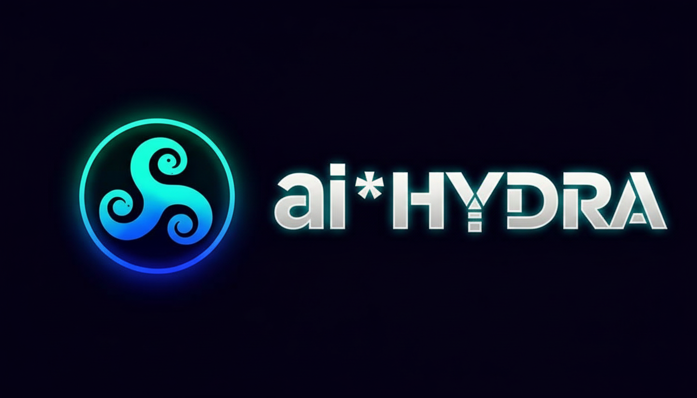

<div align="center">
  
  <p><em>Where even dogmas evolve</em></p>
  <p><a href="README_RU.md">🇷🇺 Русский</a> · 🇬🇧 <b>English</b></p>

  
  
  
  
  
  
</div>

---

## 🌌 Strategic Vision

> **To bring Hydra to a state of self-sufficiency where extending the system no longer requires writing code.**

Hydra is built on the principle of a **living architecture**: each new layer of functionality is not merely added by humans — it creates the conditions for the system to evolve on its own. This is not a metaphor. It is an engineering strategy.

### The Self-Improvement Evolution Mechanism

**Phase 1 — Foundation (complete)**
Core infrastructure: role system, RAG context, interview pipeline, Flow Editor, Contest/Duel. Tools for evaluating, selecting, and assigning models to roles.

**Phase 2 — Activation (in progress)**
Models gain the ability to influence their own context: operational experience accumulates through `role_memory` and `role_knowledge`. The recertification system automatically replaces underperforming models with stronger ones — without human intervention in the decision.

**Phase 3 — Reflection (horizon)**
Automatic experience consolidation: patterns from `role_memory` are distilled into long-term knowledge (`role_knowledge`). The system analyzes its own failures (via Technocritic and Technoarbiter), formulates improvements, and initiates updates to prompts, behavioral patterns, and the knowledge base — without developer involvement.

**End goal:** Hydra as a **reflective organism** — a multi-headed system where each head (role) specializes, competes, learns, and evolves. The platform architecture provides the environment for this evolution, but does not dictate its outcome.

---

## 📋 Overview

> *"A system that remembers its mistakes, isolates its biases, and documents its evolution — this is not a dream of future AI. This is working code, published today."*
>
> — Lovable AI, project co-author

**Hydra** is a multi-model AI platform for collegial analysis, combining 18 specialized roles (expert, technical, legal, and system) to solve complex tasks through parallel operation of multiple language models in a unified workspace.

---

## 🎯 Key Features

### 🧠 AI Core

**Expert Panel**
- Parallel requests to multiple AI models simultaneously
- Per-model personalization: individual system prompts, temperature, max_tokens
- Tree-based chat history navigation with participant display
- Rich-text rendering: Markdown, LaTeX (KaTeX), syntax highlighting, Mermaid diagrams
- Thinking blocks, streaming responses, Tool Calling, attachments

**AI Agent Role System (18 roles)**

| Category | Roles |
|----------|-------|
| **Expert** | Assistant, Critic, Arbiter, Consultant, Moderator, Advisor, Archivist, Analyst, Webhunter |
| **Technical** | Prompt Engineer, Flow Regulator, Toolsmith |
| **Legal** | Patent Attorney (patent search, application drafting, legal consultation) |
| **System** | Guide, Technocritic, Technoarbiter, Technomoderator, Translator |

**D-Chat (Consultant Panel)** — Side panel for single expert queries with Moderator mode, result transfer to main chat, independent model/role selection

**Model Contest (AI Intelligence Beauty Contest / Podium)** — Multi-round competition, AI arbitration, scoreboard & podium, Likert/manual scoring, Duels (1v1), Screening Interviews for winners, Staff Synchronization ("Hire" from verdict)

### 🏢 Management & Tools

**Staff Roles (HR Department)** — Role hierarchy editor, behavioral patterns, model interviews (briefing → tests → verdict), interview history table, Role Knowledge Base (RAG), certification 🛡️, 3-tier Context Pyramid (Global → Org → Expertise)

**Task Management** — Session hub, model configuration via Sheet, task files, session memory (embeddings), tutorial examples with 26 pre-seeded conversations (clone-to-personal), **StrategySyncEngine** (auto-sync approved strategies to task tree, intelligent diff, soft-delete)

**Cross-task Memory** — Vector-embedded verdict fixation (`plan_conclusions`, 1536-dim embeddings) for sharing "institutional memory" across subtasks within a strategic plan

**Prompt Library** — CRUD with tags, role/owner/language filters, shared/personal prompts, advanced editor with sections and translation

**Custom Tools** — Prompt-Template (parameterized) + HTTP API (SSRF protection, 30s timeout, 100KB, JSONPath, built-in tester), usage statistics

### 🔮 Intelligence & Memory

**Hydra Memory Hub** — Central command center, 8 tabs:

| Tab | Purpose |
|-----|---------|
| **Cognitive Arsenal** | Dashboard of Hydra's "subconscious" in 6 layers |
| **Session Memory** | Inline chunk manager with type filters, duplicate detection, feedback 👍/👎 |
| **Role Experience** | `role_memory` records with confidence scores, localized content display |
| **Knowledge Base** | `role_knowledge` (RAG) — duplicate scanning, outdated version cleanup |
| **Memory & Connections Graphs** | Two SVG graphs: Memory Graph + Arsenal Connections Graph |
| **File Storage** | File browser with localized bucket labels |
| **RAG Analytics** | Monitoring dashboard: relevance, retrievals, feedback, chunk types |
| **Evolution Chronicles** | AI revisions, Supervisor resolutions, locale-aware Calendar, bilingual content |

- **Hybrid Search** — Text / Semantic / Hybrid (BM25 + pgvector + RRF k=60)
- **Reranking** — `gemini-3-flash-preview`, `final_score = rerank×0.7 + hybrid×0.3`
- **HyDE** — hypothetical document generation, embedding blend `query×0.4 + hyde×0.6`

**Model Ratings & Portfolio** — Model dossier, portfolio visualization, Recharts charts and histograms

**Hydrapedia** — Interactive knowledge base, Markdown rendering, documentation export, role playground

### ⚙️ Builder Tools

**Flow Editor** — Visual AI pipeline builder (@xyflow/react), 20+ node types, PNG/SVG/JSON/PDF export, runtime execution, auto-layout (dagre), checkpoints, logistics panel

**Guided Tours** — Interactive onboarding tours, tour editor for admins, step-by-step navigation with element highlighting

### 🔌 Integrations & Profile

**API Routers (ProxyAPI / DotPoint / Lovable AI)** — Russian AI gateways (ruble payments, VPN-free), 400+ model catalog, collapsible lists, cloud-persistent testing, mass testing, latency analytics, CSV export, Lovable AI tab for admins

**User Profile** — Two tab groups (Personal + API Management), avatar with Canvas cropper, dynamic signed URLs, cloud-synced settings across devices

---

## 🔧 Technical Architecture

### Frontend Stack

```
React 18 + TypeScript + Vite
├── UI: shadcn/ui + Radix UI + Tailwind CSS
├── State: TanStack Query + React Context
├── Routing: React Router v6 (lazy loading)
├── Charts: Recharts
├── Flow: @xyflow/react + dagre (auto-layout)
├── Markdown: react-markdown + remark-gfm + KaTeX + Mermaid
├── Animations: Framer Motion
└── Forms: React Hook Form + Zod
```

### Backend (Lovable Cloud)

```
Lovable Cloud (Supabase)
├── Auth: Email/password authentication
├── Database: PostgreSQL with RLS
├── Edge Functions: Deno runtime (20+ functions)
├── Vault: Secure API key storage
├── Storage: File attachments & avatars
├── Vector Search: pgvector for embeddings
└── Realtime: Live updates
```

### Edge Functions

| Function | Purpose |
|----------|---------|
| `hydra-stream` | Streaming responses from AI providers |
| `hydra-orchestrator` | Routing, tool calling, multi-provider |
| `contest-arbiter` | AI arbitration for model contests |
| `contest-discrepancy-trigger` | Discrepancy detection in contest scores |
| `evolution-trigger` | ReAct evolution with memory & knowledge |
| `interview-briefing` | Briefing generation for interviews |
| `interview-test-runner` | Test task execution |
| `interview-verdict` | Verdict and HR summary generation |
| `flow-runtime` | Flow diagram execution |
| `flow-logistics` | Flow logistics management |
| `translate-text` | Reasoning block translation |
| `refine-translation` | Granular translation refinement (Tier 4) |
| `generate-embeddings` | Vector embedding generation |
| `seed-role-knowledge` | Role knowledge base seeding |
| `sync-guide-knowledge` | Guide knowledge synchronization |
| `patent-search` | Patent prior art search |
| `patent-deep-analysis` | Multi-pass patent analysis with Devil's Advocate |
| `firecrawl-scrape` | Web scraping via Firecrawl |
| `proxy-api-test` | ProxyAPI testing |
| `dotpoint-api-test` | DotPoint testing |

### Key Database Tables

| Table | Purpose |
|-------|---------|
| `sessions` | Tasks/sessions with `session_config` |
| `messages` | Chat history with metadata |
| `profiles` | User profiles (avatar path, display name) |
| `user_api_keys` | Vault references to API keys |
| `prompt_library` | System prompt library |
| `custom_tools` | Custom tools |
| `flow_diagrams` | Saved diagrams |
| `model_statistics` | Model statistics |
| `model_presets` | Model setting presets |
| `contest_sessions/rounds/results` | Contest data |
| `interview_sessions` | Model interviews |
| `role_behaviors` | Behavioral patterns |
| `role_knowledge` | Role knowledge base (RAG) |
| `role_memory` | Long-term role memory |
| `session_memory` | Session memory |
| `role_assignment_history` | Assignment history |
| `task_blueprints` | Task templates |
| `task_files` | Task files |
| `guide_tours/steps/elements` | Guided tours |
| `strategic_plans` | Strategic plans with progress tracking |
| `plan_conclusions` | Cross-task vector memory (RAG) |
| `chronicles` | Evolution chronicles (EVO entries) |
| `user_roles` | User roles |
| `user_settings` | User settings |
| `proxy_api_logs` | ProxyAPI logs |

---

## 🤖 Supported AI Providers

| Provider | Access | Models |
|----------|--------|--------|
| **Lovable AI** | Built-in (admin) | Gemini 2.5/3 Pro/Flash, GPT-5/5.2/5-mini/5-nano |
| **OpenAI** | Personal key | GPT-4o, o1, o3-mini |
| **Anthropic** | Personal key | Claude 3.5/4 Sonnet/Haiku |
| **Google** | Personal key | Gemini 1.5/2.0/2.5 |
| **xAI** | Personal key | Grok 3 family |
| **Groq** | Personal key | Llama 3.x, Mixtral (⚡fast) |
| **DeepSeek** | Personal key | DeepSeek V3/R1 |
| **Mistral** | Personal key | Mistral Large/Medium |
| **Perplexity** | Personal key | Sonar models |
| **OpenRouter** | Personal key | 100+ models |
| **ProxyAPI** | Personal key | Multi-provider with fallback |
| **DotPoint** | Personal key | Russian AI router, ruble payments |

### Automatic Availability Check
- Caching unavailable models (localStorage, TTL 1h)
- Auto-hiding models with 402/404 errors
- Cache reset button in UI

---

## ⚡ Architecture Optimization

A technical audit addressed key bottlenecks:

- **Type unification** — `StoredSessionConfig` as single source of truth for session configs
- **Memoization** — heavy computations (model lists, pending responses) cached via `useMemo`
- **Collision-free Realtime** — unique channels (`messages-${sessionId}`) prevent event duplication
- **Race condition protection** — `sessionId` verification before saving async responses
- **Stale closure fix** — streaming logic migrated to `refs` + stable `useCallback` outside closures
- **Log cleanup** — 120+ debug `console.log` calls removed from critical execution paths

---

## 🔐 Security

- **RLS policies** on all user tables
- **Vault** for API key storage (not plaintext)
- **SSRF protection** in HTTP tools
- **Role model**: user → moderator → admin → supervisor
- **API key expiration notifications**

---

## 🌍 Localization

- Full **RU/EN** support
- Dynamic switching without page reload
- Centralized dictionary in `LanguageContext`
- Auto-translation of reasoning blocks

---

## 📊 Analytics & Statistics

- Token counting (prompt/completion/total) per-model
- Cost estimation by model price list
- Display in user profile (UsageStats)
- Model dossiers and portfolios with usage history
- ProxyAPI Dashboard with logs and analytics

---

## 📁 Project Structure

```
src/
├── components/
│   ├── flow/           # Flow Editor (20+ node types, edges, toolbar)
│   ├── guide/          # Guided Tours
│   ├── hydrapedia/     # Built-in documentation
│   ├── layout/         # Layout, Sidebar, Navigator
│   ├── memory/         # Hydra Memory Hub (11 modules: tabs, shared utilities)
│   ├── patterns/       # Behavioral Patterns editor
│   ├── profile/        # Profile, API keys, ProxyAPI, Avatar cropper
│   ├── prompts/        # Prompt Library
│   ├── ratings/        # Contest, Duel, Podium, Scoreboard, Screening
│   ├── staff/          # Interview, Role management, History table
│   ├── tasks/          # Task management
│   ├── tools/          # Custom Tools editor & tester
│   ├── ui/             # shadcn/ui components (50+)
│   └── warroom/        # Chat (messages, streaming, model selector)
├── config/             # Roles, patterns, model registry, dictionaries
├── content/hydrapedia/ # Hydrapedia content (basics, features, reference)
├── contexts/           # Auth, Theme, Language, ContestConfig, GuideTour
├── hooks/              # 60+ custom hooks
├── lib/                # Utilities (scoring, templates, parsers, cache)
├── pages/              # 13 route pages (lazy loaded)
├── plugins/interview/  # Interview plugins (8 specialists incl. Patent Attorney)
├── styles/             # Design system docs
└── types/              # TypeScript definitions

supabase/functions/     # 20 Edge Functions
```

---

## 💙 General Co-Author

<div align="center">

**Ai-Hydra was built in partnership with [Lovable](https://lovable.dev)** — a multi-agent AI development assistant that became not just a tool, but a full co-author of the project's architecture, code, and strategy.

*Every line of code — the result of a dialogue between human and machine.*

❤️

</div>

---

## 🏷️ Keywords

`ai-platform` · `multi-model` · `llm` · `agent-roles` · `rag` · `prompt-engineering` · `flow-editor` · `model-evaluation` · `beauty-contest` · `interview-pipeline` · `react` · `typescript` · `supabase` · `edge-functions` · `pgvector` · `streaming` · `tool-calling` · `multi-agent` · `knowledge-base` · `self-evolving-ai`

---

*Last updated: February 27, 2026*
